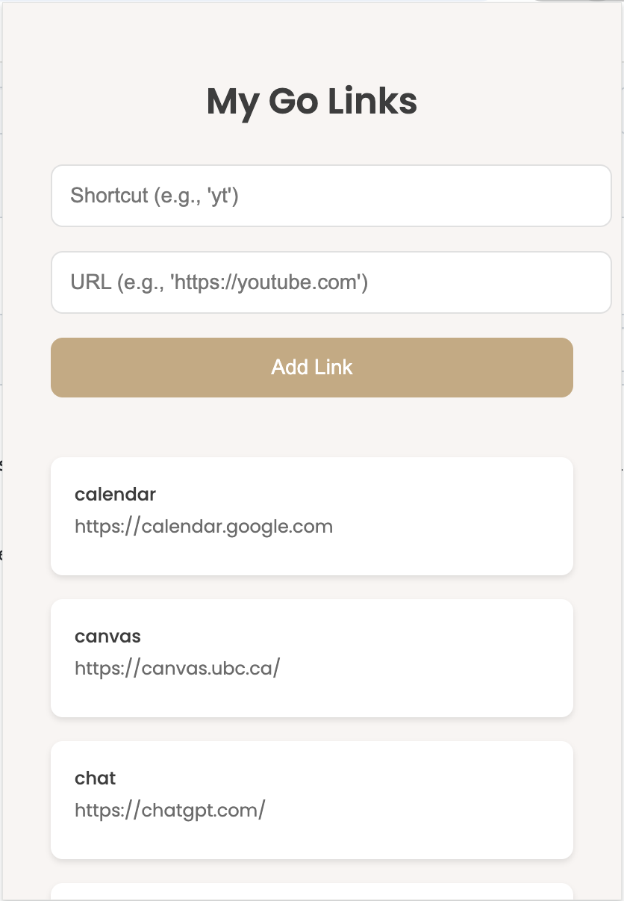

# My Go Links Chrome Extension

This is a personal Chrome extension for managing and using custom Go Links. Go Links are short, memorable URLs that redirect to longer, often-used web addresses. They're commonly used in tech companies to make navigation easier and quicker.

For example, instead of typing out "https://calendar.google.com" every time you want to check your schedule, you can simply type `go/calendar` in your browser's address bar, and the extension will take you straight there!

### Example Go Links

- `go/calendar` -> [Google Calendar](https://calendar.google.com)
- `go/docs` -> [Google Docs](https://docs.google.com)
- `go/github` -> [GitHub](https://github.com)

## Installation

1. **Clone or download this repository** to your local machine.

2. **Open Chrome** and go to `chrome://extensions/`.

3. **Enable Developer Mode** by toggling the switch in the top right corner.

4. Click on **Load unpacked** and select the folder where you cloned or downloaded the repository.

5. The extension should now appear in your list of Chrome extensions.

## Usage

1. **Type "go/" followed by your keyword** (e.g., `go/calendar`) into the Chrome address bar and press enter.

2. The extension will redirect you to the associated URL.

## Customizing Your Go Links

There are two ways to add or customize your Go Links:

### 1. Using the Extension UI



- Click on the extension icon to open the popup interface.
- Enter a shortcut and its corresponding URL in the input fields.
- Click the "Add Link" button to save the new Go Link.
- To delete a link, hover over it and click the "X" that appears in the top-right corner.

### 2. Editing the constants.js File

You can also add default Go Links by editing the `constants.js` file:

1. Open the `constants.js` file in the extension folder.
2. Modify the `DEFAULT_GO_LINKS` object to include your own short links and their corresponding URLs.

Example:

```javascript
export const DEFAULT_GO_LINKS = {
  "calendar": "https://calendar.google.com",
  "github": "https://github.com/",
  "mycustomlink": "https://example.com",
  // Add more links here
};
```

3. Save the changes and reload the extension in `chrome://extensions/`.

## License

This project is licensed under the MIT License - see the [LICENSE](LICENSE) file for details.
